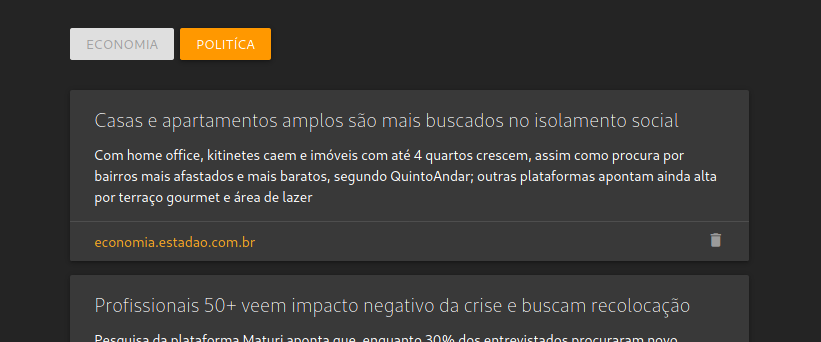

# Feedado

[](https://opensource.org/licenses/MIT)

Create custom feeds from websites without RSS. Use CSS selectors to specify the sections you want and organize them by categories.

## How to run
```bash
go get github.com/holive/feedado
cd $GOPATH/src/github.com/holive/feedado
make run
```
 
You can preview your feeds by opening `$GOPATH/src/github.com/holive/feedado/html/home.html` or create your own interface.



## How it works
In the program we have the Feed and the RSS. The Feed is the scheme from which the information used to generate the RSS is taken.

## Feed

### create
Endpoint: `POST http://localhost:8080/feed`
```json
{
	"source": "https://economia.estadao.com.br",
	"description": "Notícias de Economia e Negócios | Estadão",
	"category": "Economia",
	"sections": [
		{
			"section_selector": ".row.management section",
			"title_selector": ".text-wrapper h3",
			"subtitle_selector": ".text-wrapper p",
			"url_selector": "a"
		},
		{
			"section_selector": "#ultimas .lista section",
			"title_selector": ".third",
			"subtitle_selector": "p",
			"url_selector": ".link-title"
		}
	]
}
```

### update
Endpoint: `PUT http://localhost:8080/feed`
```json
{
	"source": "https://economia.estadao.com.br",
	"description": "Notícias de Economia e Negócios | Estadão",
	"category": "Economia",
	"sections": [
		{
			"section_selector": ".row.management section",
			"title_selector": ".text-wrapper h3",
			"subtitle_selector": ".text-wrapper p",
			"url_selector": "a"
		},
		{
			"section_selector": "#ultimas .lista section",
			"title_selector": ".third",
			"subtitle_selector": "p",
			"url_selector": ".link-title"
		}
	]
}
```

### delete
Endpoint: `DELETE http://localhost:8080/feed/{source}`

### get
Endpoint: `GET http://localhost:8080/feed/{source}`

### get all
Endpoint: `GET http://localhost:8080/feed?limit=24&offset=0`

### get all categories
Endpoint: `GET http://localhost:8080/feed/categories`

##RSS

### get all
Endpoint: `GET http://localhost:8080/rss?limit=24&offset=0

### get all by category
Endpoint: `GET http://localhost:8080/rss?limit=24&offset=0`

### delete
Endpoint: `DELETE http://localhost:8080/rss/{source}`

##Feed Worker

### reindex RSS feeds
Endpoint: `POST http://localhost:8081/feedado-worker/feed`

### reindex RSS feeds by category
Endpoint: `POST http://localhost:8081/feedado-worker/feed/category/{category}`
